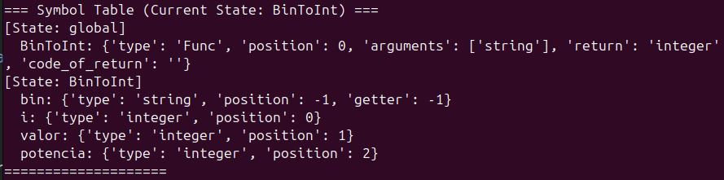

# Compilador Pascal - Projeto PL

## Introdução

Este projeto foi proposto com o intuito de desenvolver um **compilador** com uma arquitetura de **pipeline de compilação modular**, capaz de processar **código em Pascal (standard)**. Após todas as fases de análise que este efetuará, este deverá **gerar um output** com toda a informação processada, **numa linguagem semelhante a Assembly** (que posteriormente, terá de conseguir ser executado na máquina virtual disponibilizada pelos docentes)

Como ferramentas, utilizamos maioritariamente a API da biblioteca **Python PLY** (Python Lex-Yacc) e **regex** para implementar o **Analisador léxico** e **sintático**.

- **Analisador léxico**
 Efetua a análisa e reconhecimento de tokens com auxílio de expressões regulares.

- **Analisador sintático**
 Após ser definida uma gramática, permite a implementação desta e a definição das regras de linguagem, que permitam o melhor funcionamento do processamento do input. Para isto, foi empregado o módulo **YACC**

Para além disto, decidimos criar uma "**tabela de símbolos**" que permite a **análise semântica** de qualquer operação esperada em Pascal (standard). Esta tabela contém informação sobre *variáveis* e *funções* definidas no código recebido, tais como:

- O **ID** (nome atribuído) de funções e variáveis;
- O **scope** que cada variável tem (se se trata de uma **variável global** ou **local** a uma dada função);
- O **tipo** de uma variável;
- A **posição** à qual uma variável se encontra na **stack** (ou relativa ao **frame pointer**, caso se trate de um **argumento de uma função**);
- O **tipo do valor a ser devolvido** por uma função: 
  - e.g. (<u>funtion Add2Numbers(a, b: Integer): **Integer**</u>);
- O **tipo de cada argumento** de uma função;
- E uma **expressão** associada ao valor a ser retornado por uma dada função.

Assim, através das análises **léxica**, **sintática** e **semântica**, o compilador irá efetuar uma **tradução determinística baseada em gramáticas e semântica formal**,  processando o código de input em Pascal (standard) e gerando código numa linguagem de baixo nível (anteriormente mencionada), que será utilizada na  máquina virtual disponibilizada.

Após tudo ter sido efetuado, serão realizados testes para verificar a **integridade do código resultante** e a **correta execução das instruções geradas** (sendo que, o comportamento da execução do código resultante tem de ser semelhante à execução do código inicial em Pascal).

Por fim, serão discutidas potenciais melhorias e conclusões obtidas do desenvolvimento do projeto.

## Analisador léxico

Após especificar quais os **tokens** e **símbolos literais** que serão utilizados na gramática, o **Analisador léxico** usa as **Expressões regulares** a que estes estão associados para reconhecer cada **token** presente no código que foi fornecido. São definidos também comportamentos específicos para casos especiais já esperados pelo **lexer** (e.g. ignorar qualquer *whitespace* não associado a uma string ).

As **Expressões regulares** são processadas e trabalham com a **API** relativa ao **regex** em python, para a tal **captura de tokens**.

Com isto, conseguimos traduzir, tanto as **palavras reservadas** como também os **símbolos literais** para uma **liguagem em tokens**. Foi também aqui que foram feitos os tratamentos de erros léxicos.

### Exemplo

Para o seguinte programa, é feito parse dos tokens da presente em
[parsed tokens](Anexos/tokens.txt).

```pascal
1  |  program Tokenizer;
2  |  var
3  |     num: integer;
4  |  
5  |  begin
6  |     num := 5; 
7  |     while num < 5 do 
8  |     begin
9  |         num := num + 1;
10 |         writeln('teste'); 
11 |     end; 
12 |  end.
```

| Linha de código          | Tokens do Lexer                                                                                                                                   |
| ------------------ | ------------------------------------------------------------------------------------------------------------------------------------------- |
| `program Tokenizer;` | LexToken(**PROGRAM**,'program',1,5)<br>LexToken(**ID**,'Tokenizer',1,13)                                                                            |
| `var num: integer;`  | LexToken(**VAR**,'var',1,29)<br>LexToken(**ID**,'num',1,41)<br>LexToken(**:**,':',1,44)<br>LexToken(**INTEGER**\_TYPE,'integer',1,46)                      |
| `begin`              | LexToken(**BEGIN**,'begin',1,60)                                                                                                                |
| `num := 5;`          | LexToken(**ID**,'num',1,74)<br>LexToken(**ASSIGN**,':=',1,78)<br>LexToken(**INTEGER**,'5',1,81)                                                         |
| `while num < 5 do`   | LexToken(**WHILE**,'while',1,93)<br>LexToken(**ID**,'num',1,99)<br>LexToken(**<**,'<',1,103)<br>LexToken(**INTEGER**,'5',1,105)                             |
| `begin`              | LexToken(**DO**,'do',1,107)<br>LexToken(**BEGIN**,'begin',1,119)                                                                                    |
| `num := num + 1;`    | LexToken(**ID**,'num',1,137)<br>LexToken(**ASSIGN**,':=',1,141)<br>LexToken(**ID**,'num',1,144)<br>LexToken(**+**,'+',1,148)<br>LexToken(**INTEGER**,'1',1,150) |
| `writeln('teste');`  | LexToken(**ID**,'writeln',1,165)<br>LexToken(**(**,'(',1,172)<br>LexToken(**STRING**,"'teste'",1,173)<br>LexToken(**)**,')',1,180)                          |
| `end;`               | LexToken(**;**,';',1,181)<br>LexToken(**END**,'end',1,192)                                                                                          |
| `end.`               | LexToken(**;**,';',1,195)<br>LexToken(**END**,'end',1,202)<br>LexToken(**.**,'.',1,205)                                                                 |

Além das regras da linguagem Pascal, destaca-se o facto de não se distinguirem maiúsculas de minúsculas na identificação de identificadores (**IDs**). 
 Por **IDs** entende-se tudo o que não é uma string, nem um **símbolo reservado** (**token**), mas sim uma palavra definida pelo utilizador (e.g. utilizados para **variáveis** e **funções**).

 Para casos mais específicos, o uso de **Expressões Regulares** veio a ser necessário. Como exemplo, temos que, a captura de uma **string** e de um **ID** é feita com auxílio da seguinte expressão:

 ```python
 def t_STRING(t):
    r'(?P<quote>[\'\"])[^\'\"]*?(?P=quote)'
    return t

def t_ID(t):
    r'\b[A-Za-z](?:\w+?)?\b'
    return t
 ```

## Analisador sintático

Com uma gramática concreta e bem definida, o **Analisador sintático**, através do **ply.yacc**, efetua comportamentos que tenham sido definidos para cada produção criada. Estas funcionam com auxílio dos tokens devolvidos pelo **Analisador léxico**.

Antes de efetuar alguma tradução (de código Pascal para o código da linguagem de baixo nível), com apoio da **Tabela de símbolos**, será feita uma **análise semântica** do input processado pelo **Analisador sintático**. Caso esta tabela verifique que não existe qualquer erro ou conflito **semântico**, o programa irá acumular o código resultante pelas produções e este será "levado" até que todas as produções sejam interpretadas.

Utilizando o parser presente na **API** do **ply.yacc**, criámos uma gramática que deverá ser lida segundo a metodologia **LALR(1)**. Tendo isto em conta, apesar de existirem alguns conflitos *shift/reduce*, estes acabam por ser insignificantes, pelo **lookahead de 1**. Isto não tira a importância de conflitos *reduce/reduce*, sendo que estes podem levar a maiores problemas no futuro.

Como apoio visual, temos aqui a representação gráfica do autónomo criado pela nossa [gramática](Anexos/automaton.png).


Iremos muito sucintamente explicar o processo de tradução de **Expressões** e de **Instruções Globais**

#### Expressão

Neste projeto, criamos as produções de **Expressões** com base no que foi sugerido durante o periodo letivo. 
Todas as **Expressões**, retornam um triplo. Caso seja uma constante, retornará:
 - O seu **valor**
 - O seu **tipo**
 - Uma **string vazia**

Caso se trate de uma **variável** ou uma **expressão composta** (<u>3 * 3</u>, <u>(3 - 4) * (3 / 2)</u>)
 - O seu **nome da variável** (ou vazio caso se trate de uma expressão composta)
 - O seu **tipo** da variável (ou do resultado da expressão)
 - O **código** que irá colocar na **stack** os valores a ter em causa (fará *PUSH* do valor da varíavel ou irá gerar código da linguagem resultante, de maneira a devolver o valor do resultado da **expressão composta** no topo da stack) 

#### Instruções Globais
Na construção da gramática, tornou-se clara a necessidade de separar os diferentes tipos de **Instruções** que poderiam ser feitos em cada programa, dependendo do **scope** atual de cada **Instrução**.

Isto é, apesar de se poderem declarar (for-/while-)**Loops**, **Instruções Condicionais**, **Atribuições** e **Expressões** (e até combinações de **Begin** <u>Instrução</u> **End**) dentro de funções e dentro do "Begin" e "End" relativos ao "pseudo-Main" de Pascal, isto não é possível fora destes **scopes**.
Declarando estas de "**Instruções Locais**":

```py
    Instrucao : While
              | CicloFor
              | InstrucaoCondicional
              | Atribuicao 
              | Expressao
```

(É importante salientar também que decidimos que combinações **Begin** <u>Instrução</u> **End** podiam fazer parte destas dentro de certas condições, visto que é possível encapsular um bloco de **x** **Instruções** sem qualquer problema, sintáticamente, em Pascal).

No que vem a declaração de **Funções**, **Procedures** e **Variáveis**, estas só podiam ser feitas num **scope** global. No caso da declaração de **Variáveis**, dentro de outras **Instruções** deste tipo, mas fora de combinações **Begin** <u>Instrução</u> **End**.

Sendo assim, chegou a criação de "**Instruções Globais**":

```py
    GlobalInst : Dfuncao
               | Dprocedimento
               | Dvariaveis 
```

Aqui há um pequeno problema. 
Em Pascal, as **Funções** têm de ser definidas antes do bloco "**Begin** <u>Instrução</u> **End**" final, mas, no código final esperado, as **Funções** são esperadas no <u>FIM</u> do código. Para isto, as produções de **Funções** devolvem uma lista de tuplos, em que cada tuplo tem o seguinte formato:
- Uma string com o valor `"Func"`
- O código final esperado da **função**

E as produções de **Declaração de Variáveis** adicionam a esta mesma lista, tuplos com o seguinte formato:
- Uma string com o valor `"Var"`
- O código final esperado de **declaração de variáveis**

No fim da **analisade sintática** e **semântica**, o compilador irá organizar o código de maneira a priviligiar a **declaração de variáveis globais**, seguido do código dentro do último bloco **Begin** <u>Instrução</u> **End**, e finalmente, após estes, serão escritas todas as definições de funções lidas.

## Analisador semântico
De maneira a prevenir que houvesse um acesso a alguma variável local a uma função, dentro do bloco **Begin** <u>Instrução</u> **End** relativo à "main" do programa, ou de maneira a que uma variável global, possa ter o mesmo "nome" que uma variável local a uma função anteriormente definida, criámos uma "**Tabela de símbolos**"[¹](./Anexos/STable.png)



Esta serve como um "ficheiro de logs" para o programa, capaz de reter informação específica sobre os **tipos** de uma variável (para caso seja tentada uma **Atribuição** cuja **Expressão** tenha um resultado que difira do **tipo** da variável a que o valor à de ser atribuído).

Esta é também caraterizada pelo facto de poder apresentar resultados diferentes, dependendo do estado em que se encontra.
Verificar se uma variável de "nome" "x" já foi declarada ou não, pode ser feita de 2 maneiras:

- Pode ser verificada num **scope** global, ignorando qualquer **variável** local declarada dentro de qualquer **função**;
- Pode ser verificada num **scope** local, ignorando qualquer **variável** local declarada dentro de outras funções **função**, mas tendo em conta **variáveis** globais já declaradas.

Para além disto, esta tabela também verifica o tipo dos argumentos que uma dada **função** recebe e devolve, se já foi declarada alguma função com esse mesmo nome e se o valor a ser retornado por uma função é consistente com o valor passado.

Muitas features não foram mencionadas, mas através desta ferramenta, foi-nos possível garantir uma **análise semântica** robusta e consistente. 

## Geração de código

A componente de geração de código tem por base a utilização das produções, e
recorre à linguagem utilizada na [VM](https://ewvm.epl.di.uminho.pt/).

Seguindo uma filosofia de programação em stack e, utilizando pointers para posições das stacks, foi nos permitido os seguintes tipos de geração de código.

### Atribuições

A geração de código para atribuições envolve colocar um valor na stack, para que ele possa ser posteriormente armazenado ou utilizado conforme necessário.

```code
PUSHS "Ola, Mundo!"
WRITES
PUSHI 3
STOREG 0
```

No exemplo, é feito um PUSH de uma string para a stack, para posteriormente ser
escrita no output da máquina, escrita essa cuja instrução varia de acordo com o
tipo do elemento que pretendemos utilizar.

Retirando as partes das nossas produções, o código é gerado com base na estrutura
definida em generalSTable, que em conformidade com os tipos de variáveis guardadas.

### Condicionais

As instruções que traduzem código referente à execução de código segundo uma
condição necessitam de usufruir de labels para a execução de saltos do PC para
a execução dessas mesmas instruções

```code
PUSHG 0
START
PUSHI 15
STOREG 0

PUSHI 10
PUSHG 0
SUP
JZ ENDIF1

PUSHI 99
STOREG 0

ENDIF1:
STOP

```

Neste exemplo, é criada uma variável global, que designamos x.

É colocado o valor 15 na posição referente a x, ou seja, x = 15.
De seguida, é comparado x com 10, sendo que caso seja superior, x passa a ter o
valor 99.

As partes do código utilizadas são geradas por produções mais atómicas, o que
leva a que a construção desta estrutura condicional seja construída quase de imediato.

### Variáveis globais

As instruções para declarar as variáveis assentam na prática de introduzir valores
para a stack, andes do programa começar.

Isto permite que o global pointer tenha acesso direto às variáveis de forma
direta.

```code
PUSHG 0
START
```

---

### While

As estruturas de repetição **while** baseiam-se na verificação de uma condição antes da execução de um bloco de código. São utilizadas instruções de salto (labels) para criar o loop e garantir que a verificação da condição ocorre a cada iteração.

```code
START
PUSHI 0
STOREG 0        ; i = 0

WHILE_START:
PUSHI 5
PUSHG 0
INF             ; i < 5
JZ WHILE_END

PUSHG 0
WRITEI
WRITELN

PUSHG 0
PUSHI 1
ADD
STOREG 0

JUMP WHILE_START
WHILE_END:
STOP
```

Neste exemplo, enquanto `i < 5`, imprime-se o valor de `i`, seguido de uma nova linha. A cada iteração, `i` é incrementado.

---

### For

Estruturas `for` podem ser vistas como uma construção compacta de um `while`, envolvendo inicialização, condição e incremento num único bloco.

```code
START
PUSHI 0
STOREG 0        ; i = 0

FOR_START:
PUSHI 5
PUSHG 0
INF             ; i < 5
JZ FOR_END

PUSHG 0
WRITEI
WRITELN

PUSHG 0
PUSHI 1
ADD
STOREG 0

JUMP FOR_START
FOR_END:
STOP
```

Apesar de ser semanticamente um `for`, a estrutura de código gerado é idêntica ao `while`, mudando apenas a forma de organização.

---

### Funções

A definição e chamada de funções envolvem operações com `CALL` e `RETURN`. A função pode ser invocada a partir de qualquer ponto do código, e o controlo é devolvido após o `RETURN`.

```code
START
PUSHA func
CALL
STOP

func:
PUSHI 42
WRITEI
WRITELN
RETURN
```

Neste exemplo, a função `func` imprime o número `42`. O endereço da função é empilhado com `PUSHA`, seguido de um `CALL`. A função é concluída com `RETURN`.

---

### Arrays

Arrays são alocados dinamicamente com a instrução `ALLOC` ou `ALLOCN`, sendo o seu acesso feito através de índices, com as instruções `LOAD` e `STORE`.

```code
START
PUSHI 5
ALLOC          ; aloca um array com 5 inteiros
STOREG 0       ; guarda o endereço do array em gp[0]

PUSHI 10
PUSHI 2
PUSHG 0
STORE          ; armazena o valor 10 na posição 2 do array

PUSHI 2
PUSHG 0
LOAD
STOREG 1       ; armazena o valor lido em gp[1]

STOP
```

Neste exemplo, um array de 5 posições é criado e armazenado na variável global `gp[0]`. A posição 2 do array é modificada e posteriormente lida.

---

## Teste

Para testar o nosso compilador foram usados os exemplos presentes no enunciado.

---
**Exemplo 1:**
```py
1  | program HelloWorld;
2  | var
3  |     num: integer;
4  |
5  | begin
6  |     num := 0;
7  |     while num < 1 do
8  |     begin
9  |         writeln('Ola, Mundo!', 3);
10 |         write('Ola, Mundo!', 3);
11 |         num := num + 1;
12 |     end;
13 | end.
```

**Resultado da Compilação em Código Máquina:**
```
1  | START  
2  | PUSHS "Ola, Mundo!"  
3  | WRITES  
4  | PUSHI 3  
5  | WRITEI  
6  | WRITELN  
7  | PUSHS "Ola, Mundo!"  
8  | WRITES  
9  | PUSHI 3  
10 | WRITEI  
11 | STOP  
```
---

**Exemplo 2:**
```py
1  | program Maior3;
2  | var
3  |     num1, num2, num3, maior, num: integer;
4  |
5  | begin
6  |     num := 0;
7  |     while num < 1 do
8  |     begin
9  |         write('Introduza o primeiro número: ');
10 |         readln(num1);
11 |         write('Introduza o segundo número: ');
12 |         readln(num2);
13 |         write('Introduza o terceiro número: ');
14 |         readln(num3);
15 |         if num1 > num2 then
16 |             if num1 > num3 then
17 |                 maior := num1
18 |             else
19 |                 maior := num3
20 |         else
21 |             if num2 > num3 then
22 |                 maior := num2
23 |             else
24 |                 maior := num3;
25 |         writeln('O maior é: ', maior);
26 |         num := num + 1;
27 |     end;
28 | end.
```

**Resultado da Compilação em Código Máquina:**
```
1  | PUSHI 0  
2  | PUSHI 0  
3  | PUSHI 0  
4  | PUSHI 0  
5  | START  
6  | PUSHS "Introduza o primeiro número: "  
7  | WRITES  
8  | READ  
9  | ATOI  
10 | STOREG 0  
11 | WRITELN  
12 | PUSHS "Introduza o segundo número: "  
13 | WRITES  
14 | READ  
15 | ATOI  
16 | STOREG 1  
17 | WRITELN  
18 | PUSHS "Introduza o terceiro número: "  
19 | WRITES  
20 | READ  
21 | ATOI  
22 | STOREG 2  
23 | WRITELN  
24 | PUSHG 0  
25 | PUSHG 1  
26 | SUP  
27 | JZ ELSE3  
28 | PUSHG 0  
29 | PUSHG 2  
30 | SUP  
31 | JZ ELSE1  
32 | PUSHG 0  
33 | STOREG 3  
34 | JUMP ENDIF1  
35 | ELSE1:  
36 | PUSHG 2  
37 | STOREG 3  
38 | ENDIF1:  
39 | JUMP ENDIF3  
40 | ELSE3:  
41 | PUSHG 1  
42 | PUSHG 2  
43 | SUP  
44 | JZ ELSE2  
45 | PUSHG 1  
46 | STOREG 3  
47 | JUMP ENDIF2  
48 | ELSE2:  
49 | PUSHG 2  
50 | STOREG 3  
51 | ENDIF2:  
52 | ENDIF3:  
53 | PUSHS "O maior é: "  
54 | WRITES  
55 | PUSHG 3  
56 | WRITEI  
57 | WRITELN  
58 | STOP   
```
---

**Exemplo 3:**
```py
1  | program Fatorial;
2  | var
3  |     n, i, fat, num: integer;
4  |
5  | begin
6  |     num := 0;
7  |     while num < 1 do
8  |     begin
9  |         writeln('Introduza um número inteiro positivo:');
10 |         readln(n);
11 |         fat := 1;
12 |         for i := 1 to n do
13 |             fat := fat * i;
14 |         writeln('Fatorial de ', n, ': ', fat);
15 |         num := num + 1;
16 |     end;
17 | end.
```

**Resultado da Compilação em Código Máquina:**
```
1  | PUSHI 0
2  | PUSHI 0
3  | PUSHI 0
4  | START
5  | PUSHS "Introduza um número inteiro positivo:"
6  | WRITES
7  | WRITELN
8  | READ
9  | ATOI
10 | STOREG 0
11 | WRITELN
12 | PUSHI 1
13 | STOREG 2
14 | PUSHI 1
15 | STOREG 1
16 | PUSHG 0
17 | PUSHI 1
18 | ADD
19 | FORSTART0:
20 | PUSHL 0
21 | PUSHG 1
22 | EQUAL
23 | NOT
24 | JZ FOREND0
25 | PUSHG 2
26 | PUSHG 1
27 | MUL
28 | STOREG 2
29 | PUSHG 1
30 | PUSHI 1
31 | ADD
32 | STOREG 1
33 | JUMP FORSTART0
34 | FOREND0:
35 | POP 1
36 | PUSHS "Fatorial de "
37 | WRITES
38 | PUSHG 0
39 | WRITEI
40 | PUSHS ": "
41 | WRITES
42 | PUSHG 2
43 | WRITEI
44 | WRITELN
45 | STOP 
```
---

**Exemplo 4:**
```py
1  | program NumeroPrimo;
2  | var
3  |     num, i: integer;
4  |     primo: boolean;
5  |
6  | begin
7  |     writeln('Introduza um número inteiro positivo:');
8  |     readln(num);
9  |     primo := true;
10 |     i := 2;
11 |     while (i <= (num div 2)) and primo do
12 |     begin
13 |         if (num mod i) = 0 then
14 |             primo := false;
15 |         i := i + 1;
16 |     end;
17 |     if primo then
18 |         writeln(num, ' é um número primo')
19 |     else
20 |         writeln(num, ' não é um número primo')
21 | end.
```

**Resultado da Compilação em Código Máquina:**
```
1  | PUSHI 0  
2  | PUSHI 0  
3  | PUSHI 0  
4  | START  
5  | PUSHS "Introduza um número inteiro positivo:"  
6  | WRITES  
7  | WRITELN  
8  | READ  
9  | ATOI  
10 | STOREG 0  
11 | WRITELN  
12 | PUSHI 1  
13 | STOREG 2  
14 | PUSHI 2  
15 | STOREG 1  
16 | WHILE1:  
17 | PUSHG 1  
18 | PUSHG 0  
19 | PUSHI 2  
20 | DIV  
21 | INFEQ  
22 | PUSHG 2  
23 | AND  
24 | JZ ENDWHILE1  
25 | PUSHG 0  
26 | PUSHG 1  
27 | MOD  
28 | PUSHI 0  
29 | EQUAL  
30 | JZ ELSE1  
31 | PUSHI 0  
32 | STOREG 2  
33 | JUMP ENDIF1  
34 | ELSE1:  
35 | ENDIF1:  
36 | PUSHG 1  
37 | PUSHI 1  
38 | ADD  
39 | STOREG 1  
40 | JUMP WHILE1  
41 | ENDWHILE1:  
42 | PUSHG 2  
43 | JZ ELSE2  
44 | PUSHG 0  
45 | WRITEI  
46 | PUSHS " é um número primo"  
47 | WRITES  
48 | WRITELN  
49 | JUMP ENDIF2  
50 | ELSE2:  
51 | PUSHG 0  
52 | WRITEI  
53 | PUSHS " não é um número primo"  
54 | WRITES  
55 | WRITELN  
56 | ENDIF2:  
57 | STOP  
```
---


**Exemplo 5:**
```py
1  | program SomaArray;
2  | var
3  |     numeros: array[1..5] of integer;
4  |     i, soma: integer;
5  |
6  | begin
7  |     soma := 0;
8  |     writeln('Introduza 5 números inteiros:');
9  |     for i := 1 to 5 do
10 |     begin
11 |         readln(numeros[i]);
12 |         soma := soma + numeros[i];
13 |     end;
14 |     writeln('A soma dos números é: ', soma);
15 | end.
```

**Resultado da Compilação em Código Máquina:**
```
1  | PUSHN 5
2  | PUSHI 0
3  | PUSHI 0
4  | START
5  | PUSHI 0
6  | STOREG 6
7  | PUSHS "Introduza 5 números inteiros:"
8  | WRITES
9  | WRITELN
10 | PUSHI 1
11 | STOREG 5
12 | PUSHI 5
13 | PUSHI 1
14 | ADD
15 | FORSTART0:
16 | PUSHL 0
17 | PUSHG 5
18 | EQUAL
19 | NOT
20 | JZ FOREND0
21 | PUSHGP
22 | PUSHI 0
23 | PADD
24 | PUSHG 5
25 | PUSHI 1
26 | SUB
27 | READ
28 | ATOI
29 | STOREN
30 | WRITELN
31 | PUSHG 6
32 | PUSHGP
33 | PUSHI 0
34 | PADD
35 | PUSHG 5
36 | PUSHI 1
37 | SUB
38 | LOADN
39 | ADD
40 | STOREG 6
41 | PUSHG 5
42 | PUSHI 1
43 | ADD
44 | STOREG 5
45 | JUMP FORSTART0
46 | FOREND0:
47 | POP 1
48 | PUSHS "A soma dos números é: "
49 | WRITES
50 | PUSHG 6
51 | WRITEI
52 | WRITELN
53 | STOP
```
---

**Exemplo 6:**
```py
1  | program BinarioParaInteiro;
2  | var
3  |     bin: string;
4  |     i, valor, potencia: integer;
5  |
6  | begin
7  |     writeln('Introduza uma string binária:');
8  |     readln(bin);
9  |     valor := 0;
10 |     potencia := 1;
11 |     for i := length(bin) downto 1 do
12 |     begin
13 |         if bin[i] = '1' then
14 |             valor := valor + potencia;
15 |         potencia := potencia * 2;
16 |     end;
17 |     writeln('O valor inteiro correspondente é: ', valor);
18 | end.
```

**Resultado da Compilação em Código Máquina:**
```
1  | PUSHS ""
2  | PUSHI 0
3  | PUSHI 0
4  | PUSHI 0
5  | START
6  | PUSHS "Introduza uma string binária:"
7  | WRITES
8  | WRITELN
9  | READ
10 | STOREG 0
11 | WRITELN
12 | PUSHI 0
13 | STOREG 2
14 | PUSHI 1
15 | STOREG 3
16 | PUSHG 0
17 | STRLEN
18 | STOREG 1
19 | PUSHI 1
20 | PUSHI 1
21 | SUB
22 | FORSTART0:
23 | PUSHL 0
24 | PUSHG 1
25 | EQUAL
26 | NOT
27 | JZ FOREND0
28 | PUSHG 0
29 | PUSHG 1
30 | PUSHI 1
31 | SUB
32 | CHARAT
33 | PUSHS "1"
34 | CHRCODE
35 | EQUAL
36 | JZ ELSE1
37 | PUSHG 2
38 | PUSHG 3
39 | ADD
40 | STOREG 2
41 | JUMP ENDIF1
42 | ELSE1:
43 | ENDIF1:
44 | PUSHG 3
45 | PUSHI 2
46 | MUL
47 | STOREG 3
48 | PUSHG 1
49 | PUSHI 1
50 | SUB
51 | STOREG 1
52 | JUMP FORSTART0
53 | FOREND0:
54 | POP 1
55 | PUSHS "O valor inteiro correspondente é: "
56 | WRITES
57 | PUSHG 2
58 | WRITEI
59 | WRITELN
60 | STOP
```
---

**Exemplo 7:**
```py
1  | program BinarioParaInteiro;
2  |
3  | function BinToInt(bin: string): integer;
4  | var
5  |     i, valor, potencia: integer;
6  | begin
7  |     valor := 0;
8  |     potencia := 1;
9  |     for i := length(bin) downto 1 do
10 |     begin
11 |         if bin[i] = '1' then
12 |             valor := valor + potencia;
13 |         potencia := potencia * 2;
14 |     end;
15 |     BinToInt := valor;
16 | end;
17 |
18 | var
19 |     bin: string;
20 |     valor: integer;
21 |
22 | begin
23 |     writeln('Introduza uma string binária:');
24 |     readln(bin);
25 |     valor := BinToInt(bin);
26 |     writeln('O valor inteiro correspondente é: ', valor);
27 | end.
```

**Resultado da Compilação em Código Máquina:**
```
1  | PUSHS ""
2  | PUSHI 0
3  | START
4  | PUSHS "Introduza uma string binária:"
5  | WRITES
6  | WRITELN
7  | READ
8  | STOREG 3
9  | WRITELN
10 | PUSHG 3
11 | PUSHA BinToInt
12 | CALL
13 | STOREG 4
14 | PUSHS "O valor inteiro correspondente é: "
15 | WRITES
16 | PUSHG 4
17 | WRITEI
18 | WRITELN
19 | STOP
20 | BinToInt:
21 | PUSHI 0
22 | PUSHI 0
23 | PUSHI 0
24 | PUSHI 0
25 | STOREG 1
26 | PUSHI 1
27 | STOREG 2
28 | PUSHFP
29 | LOAD -1
30 | STRLEN
31 | STOREG 0
32 | PUSHI 1
33 | PUSHI 1
34 | SUB
35 | FORSTART0:
36 | PUSHL 0
37 | PUSHG 0
38 | EQUAL
39 | NOT
40 | JZ FOREND0
41 | PUSHL -1
42 | PUSHG 0
43 | PUSHI 1
44 | SUB
45 | CHARAT
46 | PUSHS "1"
47 | CHRCODE
48 | EQUAL
49 | JZ ELSE1
50 | PUSHG 1
51 | PUSHG 2
52 | ADD
53 | STOREG 1
54 | JUMP ENDIF1
55 | ELSE1:
56 | ENDIF1:
57 | PUSHG 2
58 | PUSHI 2
59 | MUL
60 | STOREG 2
61 | PUSHG 0
62 | PUSHI 1
63 | SUB
64 | STOREG 0
65 | JUMP FORSTART0
66 | FOREND0:
67 | POP 1
68 | PUSHG 1
69 | RETURN
```

---


## Melhorias

Apesar de não termos implementado a tradução de **Procedures**, estes acabam por se basear muito na definição de **Funções**, onde a única diferença aparente é que um **Procedure** pode alterar o valor original do argumento que lhe foi passado (tal como em C, quando passamos um pointer como argumento a uma função).
Podia ter havido alguma otimização na tradução de código, no que vem a alguma redundância gerada. 
(e.g.  Ao declarar uma variável, em vez de passar logo a instrução "**PUSHG 0**", podiamos esperar a que lhe fosse atribuído um valor e <u>SÓ AÍ</u> seria realmente passada para a stack).


## Conclusão

Este projeto permitiu-nos aprofundar os conhecimentos adquiridos nas aulas de
Processamento de Linguagens de uma forma prática e interessante. Fez-nos perceber como é efetuado o trabalho de um compilador e deu um novo significado a "memory management". 

Gostaríamos de ter implementado mais funcionalidades, porém, fizemos tudo o que nos foi possível com o tempo e recursos dados.

Temos ainda no Anexo A alguns exemplos de execução do nosso projeto para alguns programas-fonte escritos na nossa linguagem de programação.
