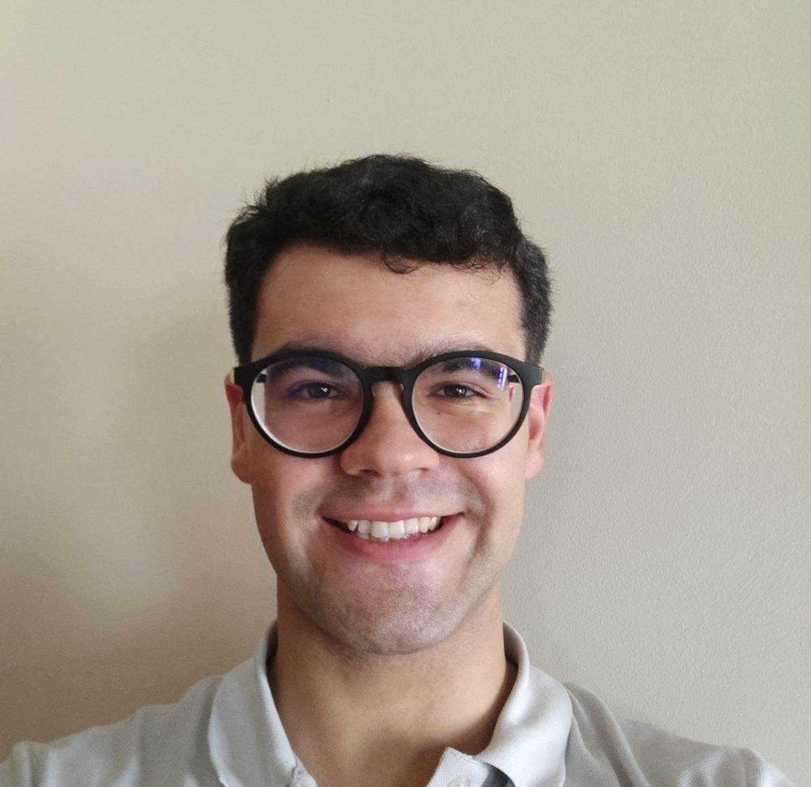

# PL2025

## Unidade Curricular

* *Nome:* Processamento de linguagens
* *Sigla:* PL
* *Ano:* 2025  

## Aluno

* *Nome:* David Filipe Rocha Figueiredo  
* *Número:* A104360
* *Foto:*  

Este repositório tem o objetivo de manter os TPC que serão resolvidos ao longo do semestre para a UC de Processamento de Linguagens do ano letivo de 2024/2025.
